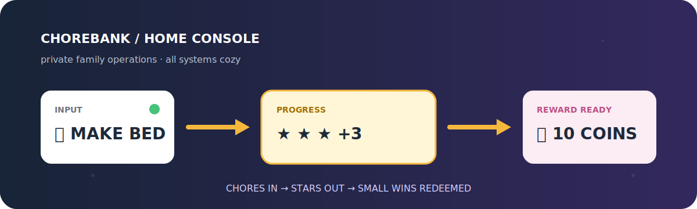
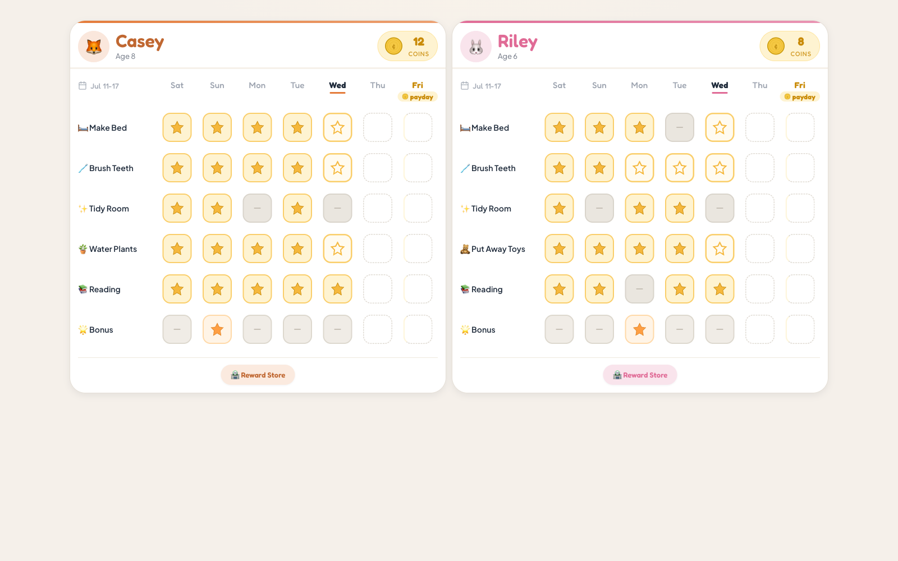
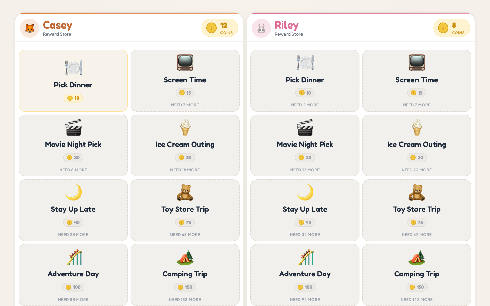
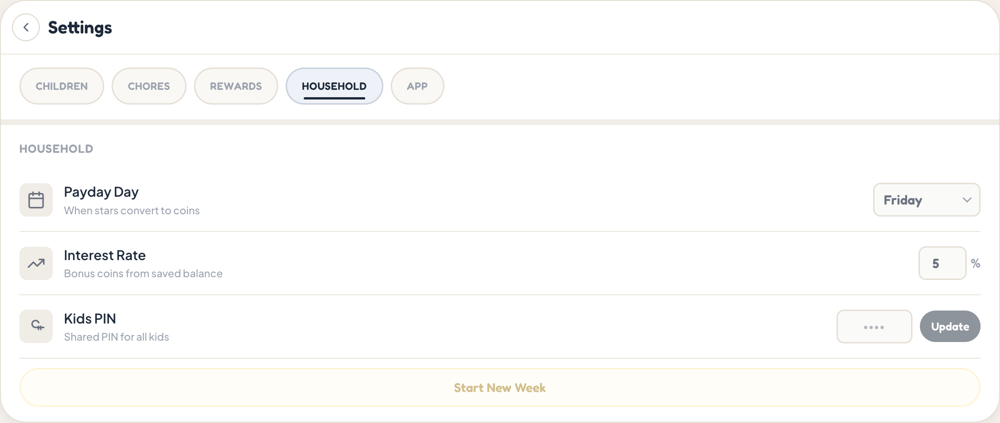

# Chorebank

<p align="center">
  
</p>

<p align="center">
  A private, self-hosted chore and rewards board for the whole household.
</p>

<p align="center">
  <a href="https://github.com/dhalarewich/chorebank/actions/workflows/ci.yml"></a>
  <a href="LICENSE"></a>
  
  
</p>

Chorebank turns household work into a simple loop: parents create chores and rewards, kids claim stars, payday converts stars to coins, and kids redeem their coins. Household data stays in the PostgreSQL database you operate.

## What it does

- Tablet-friendly chore boards for each child.
- Parent tools to award stars, run payday, and fulfill redemptions.
- Household settings for children, shared chores, rewards, payout rules, and preferences.
- Protected browser setup for a brand-new installation.
- Interactive parent-password recovery from the application console.

## Gallery

| Kids' chore board | Reward store |
| --- | --- |
|  |  |

| Parent household settings |
| --- |
|  |

All gallery images use fictional demo data and contain no real household information.

## Quick start: Docker Compose

This is the supported home-server, NAS, and small-computer path.

```bash
git clone https://github.com/dhalarewich/chorebank.git
cd chorebank
cp .env.example .env
node -e "console.log(require('node:crypto').randomBytes(32).toString('base64url'))"
```

Generate two random values. Put them in `AUTH_SECRET` and `SETUP_TOKEN`, choose a long `POSTGRES_PASSWORD`, and set a lowercase `DEFAULT_HOUSEHOLD_ID` slug in `.env`. Production rejects secrets shorter than 32 characters or obvious placeholder values. Then start Chorebank:

```bash
docker compose up --build -d
docker compose ps
```

Open `http://SERVER_LAN_IP:3000`. A blank installation redirects to `/setup`. Enter `SETUP_TOKEN`, then create the household, parent login, shared kid PIN, and first child. Setup permanently closes once the household exists.

The equivalent terminal wizard is available as `docker compose exec app npm run setup`. It refuses to run when household data already exists and never resets or overwrites data.

Android tablets are regular browser clients. Open the LAN address in Chrome and use **Add to Home screen** if useful. Chorebank is not an offline PWA or native Android app.

## Deploy on Railway

[](https://railway.com/deploy/chorebank-v1)

The template creates Chorebank and PostgreSQL together with generated secrets and no configuration questions. After deployment, open the app service variables, copy `SETUP_TOKEN`, and complete `/setup`. See the [Railway deployment guide](docs/railway.md) for backups, recovery, and updates.

## Quick start: Node.js

Use Node.js 22+ and PostgreSQL:

```bash
npm ci
cp .env.example .env
# Set DATABASE_URL, DIRECT_URL, AUTH_SECRET, SETUP_TOKEN,
# and DEFAULT_HOUSEHOLD_ID in .env.
npm run prisma:generate
npm run prisma:migrate:deploy
npm run dev
```

Open `http://localhost:3000/setup`, or run `npm run setup` with the same slug as `DEFAULT_HOUSEHOLD_ID`. For production, run `npm run build` followed by `npm run start`.

## Operate safely

```bash
# Stop without deleting data
docker compose down

# Update the checked-out release
git pull
# Pull the app base image and PostgreSQL image before recreating services
docker pull node:22-bookworm-slim
docker pull postgres:16-alpine
docker compose up --build -d

# Back up PostgreSQL in its custom format
docker compose exec -T db pg_dump -U chorebank -Fc -d chorebank > chorebank-backup.dump

# Restore a backup, then restart the app
docker compose stop app
if docker compose exec -T db pg_restore -U chorebank -d postgres --clean --if-exists --create --exit-on-error < chorebank-backup.dump; then
  docker compose start app
else
  docker compose start app
  exit 1
fi

# Recover a parent login interactively
docker compose exec app npm run password:reset
```

The `chorebank-postgres` volume survives `docker compose down`. Do not run `docker compose down -v` unless you deliberately want to remove the database after taking a backup.

The recovery command lists parent accounts, requires exact email confirmation, prompts privately for a new 12+ character password, and changes no household data. After a suspected credential compromise, rotate `AUTH_SECRET` as well to invalidate every active session.

## Development

```bash
npm ci
cp .env.example .env
npm run prisma:generate
npm run prisma:migrate:deploy
npm run lint
npm run typecheck
npm test
npm run test:e2e
npm run build
```

CI runs validation, dependency auditing, and the core browser loop against a real PostgreSQL service. `npm run prisma:seed` deliberately does not create a household; use `/setup` or `npm run setup` once against an empty database.

See [CONTRIBUTING.md](CONTRIBUTING.md) for contribution workflow, [AGENTS.md](AGENTS.md) for repository guidance, and [llms.txt](llms.txt) for a compact AI-readable project map.

## Support and security

Use [GitHub Issues](https://github.com/dhalarewich/chorebank/issues) for public bugs and documentation problems. Remove household names, emails, credentials, IP addresses, database URLs, and identifying screenshots before posting.

Report vulnerabilities through a private [GitHub security advisory](https://github.com/dhalarewich/chorebank/security/advisories/new), not a public issue. See [SECURITY.md](SECURITY.md), [CHANGELOG.md](CHANGELOG.md), and [RELEASE_NOTES.md](RELEASE_NOTES.md).

For the current release posture and evidence, read the [open-source readiness report](OPEN_SOURCE_READINESS_REPORT.md) and [V1 code audit](CODE_AUDIT_REPORT.md).

## Scope and license

Docker Compose with PostgreSQL is the supported self-hosted path; Railway is the streamlined hosted option. Vercel with managed PostgreSQL remains possible through `npm run vercel-build`, but is optional. SQLite, offline sync/PWA, and native-tablet packaging are intentionally deferred; see [ARCHITECTURE_OPTIONS.md](ARCHITECTURE_OPTIONS.md).

Chorebank is available under the permissive [MIT License](LICENSE).
